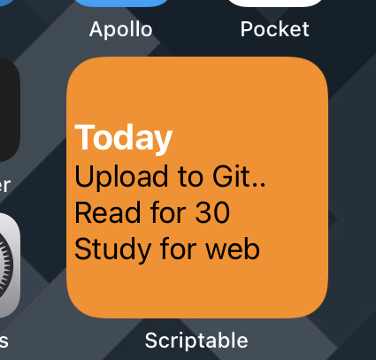

# Widgets Written for iOS Using the [Scriptable](scriptable.app) Application

This repository hosts constantly in-progress widgets I am playing around with using the Scriptable application. Feel free to use anything here and make it your own. Most of these are highly tailored to my personal setup but hopefully they are easy to understand and can serve as good examples.

## Requirements
- iOS 14
- Scriptable application: free application which lets you write iOS automation using JavaScript, including widget creation

## Resources
- [Save Script](https://www.icloud.com/shortcuts/8b0f865da9ee4b5085105b17db680c1d): helpful shortcut which allows you to easily download scripts from a GitHub repository to your iCloud Scriptable folder

# trello-widget

A script that generates a widget to display items from a Trello board.

## Requirements
- Trello API key & token
- Have the list id of a list starting with a card called "Today" and stopping at a card called "In Progress"
