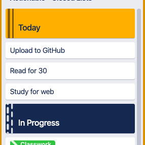

# trello-widget
A script for the [Scriptable](scriptable.app) IOS app that generates a widget to display items from a Trello board.

For personal use but feel free to implement it to your own board. The specific implementation is hard coded to the location and format of my daily task list but this is easily adaptable!

## Requirements
- IOS 14
- Trello API key & token
- Have the list id of a list starting with a card called "Today" and stopping at a card called "In Progress"

 ----> 
